# Capstone Project - Azure ML Engineer

This project explores a classification task with Kaggle's Credit Defaulter Dataset, focusing on `accuracy` as the main performance metric, using both AutoML and hyperparameter tuning. In the AutoML experiment, I configure the settings and submit the run to automatically find the model with the highest accuracy. For hyperparameter tuning, I create a training and scoring script that applies logistic regression, then set up a Hyperdrive experiment with a specified range of parameter values to explore the model's performance. I will compare the best models from each approach and deploy the one with superior accuracy. This repository includes:

- `credit-card-default.csv`: the credit card default dataset
- `automl.ipynb`: notebooks where the experiments using AutoML are conducted
- `hyperparameter_tuning.ipynb`: notebooks where the experiments using HyperDrive are conducted
- `train.py`: the training script and environment dependencies for the Hyperdrive setup
- `conda_dependencies.yml`: environment dependencies for the Hyperdrive setup
- `cond_env.yml`: the experiment environment configuration
- `scoring.py`: the script used in the inference configuration after deployment

## Dataset

### Overview
This is the Credit Defaulter Dataset obtained from Kaggle, which can be found [here](https://www.kaggle.com/datasets/mukeshmanral/credit-card-defaulte/data). It includes demographic information, credit details, payment history, and bill statements of credit card clients in Norway, covering the period from May 2018 to October 2018. The dataset consists of multiple features and a target column indicating whether the client defaulted on their payment (1 for default, 0 for no default).

### Task
The task is a classification problem, with the target variable `defaulted.payment.next.month` (1 indicates the client defaulted on payment; 0 indicates no default). Given the dataset’s range of features, I will use all available columns in the analysis. Below is a description of the dataset features:


| **Feature**                   | **Description**                                                                                                                                                  |
|-------------------------------|------------------------------------------------------------------------------------------------------------------------------------------------------------------|
| `id`                          | ID of each client                                                                                                                                                |
| `limitBal`                    | Amount of credit granted in NT dollars (includes individual and family/supplementary credit)                                                                     |
| `sex`                         | Gender (1 = male, 0 = female)                                                                                                                                    |
| `education`                   | Education level (1 = graduate school, 2 = university, 3 = high school, 4 = others, 5 = unknown, 6 = unknown)                                                    |
| `married`                     | Marital status (1 = married, 2 = single, 3 = others)                                                                                                             |
| `age`                         | Age in years                                                                                                                                                     |
| `pay_0`                       | Repayment status in September 2018 (-1 = paid duly, 1 = payment delayed one month, 2 = delayed two months, ..., 8 = delayed eight months, 9 = nine months+)     |
| `pay_2`                       | Repayment status in August 2018 (same scale as above)                                                                                                            |
| `pay_3`                       | Repayment status in July 2018 (same scale as above)                                                                                                              |
| `pay_4`                       | Repayment status in June 2018 (same scale as above)                                                                                                              |
| `pay_5`                       | Repayment status in May 2018 (same scale as above)                                                                                                               |
| `pay_6`                       | Repayment status in April 2018 (same scale as above)                                                                                                             |
| `billAmt_1`                   | Amount of bill statement in September 2018 (NT dollars)                                                                                                          |
| `billAmt_2`                   | Amount of bill statement in August 2018 (NT dollars)                                                                                                             |
| `billAmt_3`                   | Amount of bill statement in July 2018 (NT dollars)                                                                                                               |
| `billAmt_4`                   | Amount of bill statement in June 2018 (NT dollars)                                                                                                               |
| `billAmt_5`                   | Amount of bill statement in May 2018 (NT dollars)                                                                                                                |
| `billAmt_6`                   | Amount of bill statement in April 2018 (NT dollars)                                                                                                              |
| `payAmt_1`                    | Amount of previous payment in September 2018 (NT dollars)                                                                                                        |
| `payAmt_2`                    | Amount of previous payment in August 2018 (NT dollars)                                                                                                           |
| `payAmt_3`                    | Amount of previous payment in July 2018 (NT dollars)                                                                                                             |
| `payAmt_4`                    | Amount of previous payment in June 2018 (NT dollars)                                                                                                             |
| `payAmt_5`                    | Amount of previous payment in May 2018 (NT dollars)                                                                                                              |
| `payAmt_6`                    | Amount of previous payment in April 2018 (NT dollars)                                                                                                            |
| `defaulted.payment.next.month`| Target variable indicating default payment for the next month (1 = yes, 0 = no)                                                                                  |

### Access
I began by uploading the dataset to GitHub, then copied its raw URL. This URL was used to access the dataset through `Dataset.Tabular`. Additionally, I registered the dataset to the workspace to ensure that both the AutoML and Hyperdrive notebooks could access the same data.

## Automated ML

Settings:
- **Experiment Timeout**: Set to a maximum of 30 minutes to ensure timely completion.
- **Concurrent Iterations**: Up to 5 iterations run simultaneously to accelerate training.
- **Primary Metric**: Accuracy, chosen to align with the logistic regression method used in the Hyperdrive configuration. While Accuracy was selected, a metric better suited for imbalanced data, such as AUC-weighted, may have been ideal.
- **Early Stopping**: Enabled to halt training if additional iterations are unlikely to improve performance.

Config:
- **Task**: Classification
- **Dataset**: Trained on 80% of the dataset to match the Hyperdrive settings (`test_size` = 0.2).
- **Label**: "defaulted" column
- **Featurization**: Automatic feature engineering is enabled (`featurization` = 'auto').
- **Logging**: Debug logs are saved in "automl_errors.log".

**AutoML notebook: Run experiment** \
Finished run the AutoML notebook experiment


**AutoML notebook: RunDetails widget** \
All of the RunDetails widget log in the notebook
Cross validation of the dataset, number of fold is 3

Pass all of the data validation steps
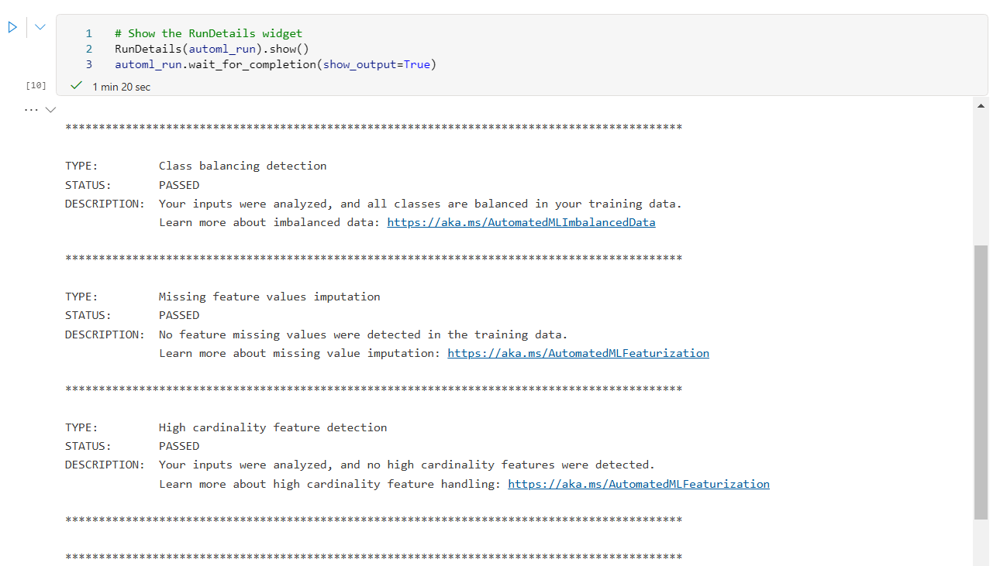
Iterated through different algorithms to find the best model
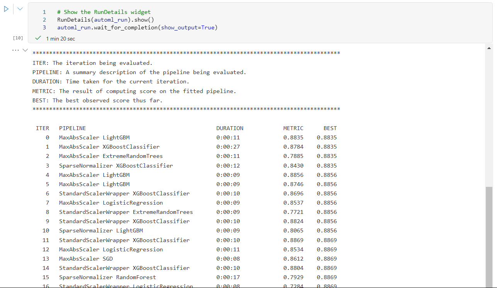
All the log of RunDetails


**Best AutoML model** \
Best automl model, get_output with ID
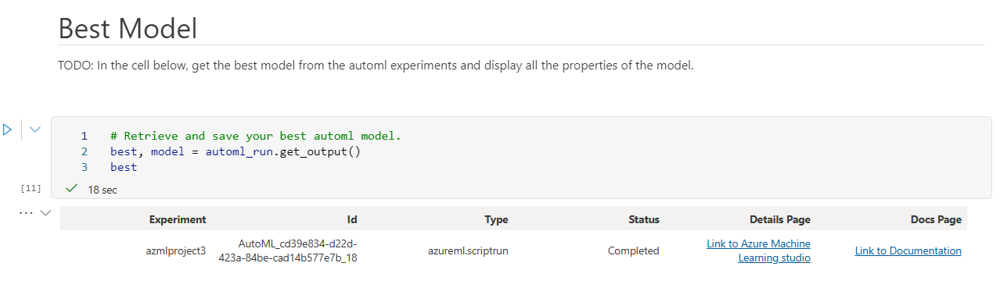
Best automl model properties
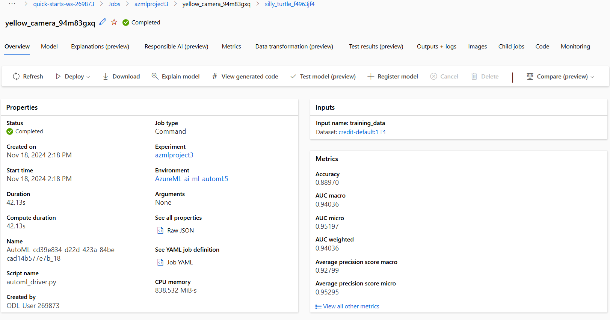

**Register AutoML best model** \
Registered AutoML best model in code

Registered AutoML best model in Model list
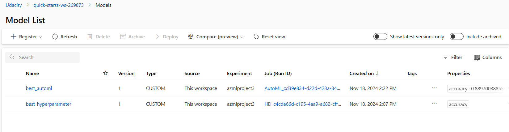

For the AutoML run, the best model selected was a **Voting Ensemble** with the following metrics:
- **Accuracy**: 0.8897
- **AUC (Macro)**: 0.94233
- **AUC (Micro)**: 0.95226
- **AUC (Weighted)**: 0.94036
- **Average Precision Score (Macro)**: 0.93200
- **Average Precision Score (Micro)**: 0.95313

### Results
The best-performing model from the AutoML run was a Voting Ensemble, with an accuracy of `0.8897`. Although this accuracy may seem moderate, the model’s AUC-weighted score was high (`0.94036`), likely due to the slightly imbalanced nature of the dataset.

## Hyperparameter Tuning

I applied a simple logistic regression model, tuning two key parameters:
- `C`: Controls regularization strength, with smaller values increasing regularization. A continuous random value between 0.1 and 10 was used.
- `max_iter`: Sets the maximum number of iterations for convergence. Discrete values of 50, 75, and 100 were tested.

**Setting Random sampling and early stop policy**


**Hyperparameter notebook: Run experiment** \
Finished run the Hyperparameter notebook experiment


**Hyperparameter notebook: RunDetails widget** \
All of the RunDetails widget log in the notebook


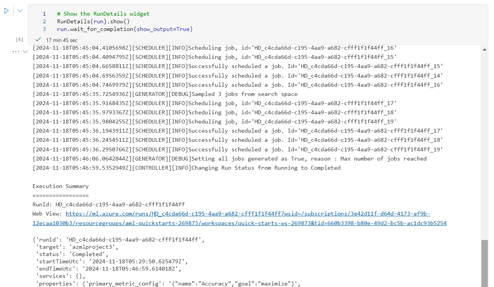


### Results
The hyperparameter tuning process yielded a best accuracy of `0.7327`, achieved with `C=0.763899` and `max_iter=100`. Further improvements could be explored by expanding the parameter range or adding other parameters like the solver.

**Save the best model of Hyperparameter notebook**
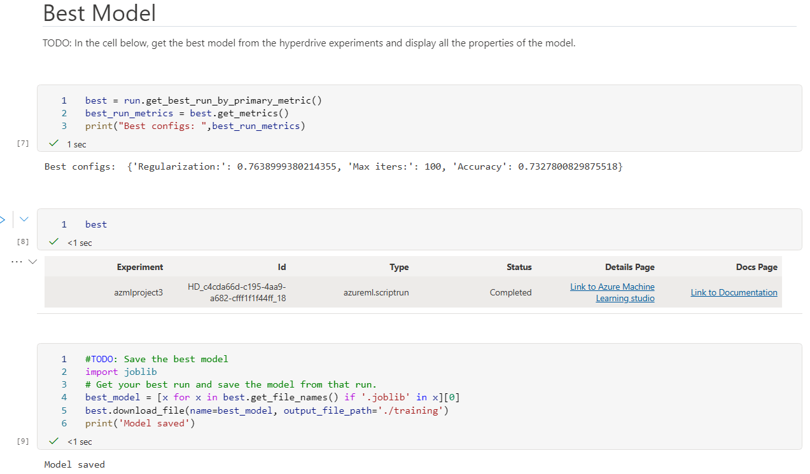

**Register Hyperparameter best model** \
Register Hyperparameter best model in code

Register Hyperparameter best model in Model list
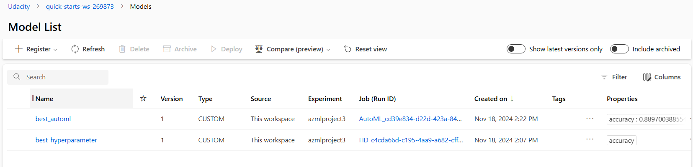

## Model Deployment

**Explain the chosen model**
The AutoML-selected model, a **Voting Ensemble**, was chosen as the final model due to its superior performance across multiple metrics. This ensemble model achieved an accuracy of **0.8897**, which significantly outperformed the hyperparameter tuning's best logistic regression model with an accuracy of **0.7327**. Additionally, the Voting Ensemble demonstrated robust handling of the dataset's slight imbalance, as evidenced by its **AUC-weighted score of 0.94036**. This higher AUC indicates better model performance in distinguishing between the classes. The ensemble approach in the AutoML model leveraged multiple algorithms to enhance prediction accuracy and was ultimately selected as the best model for deployment.

The best model from the AutoML experiment was deployed with authentication enabled for secure access and app insight enable for monitoring.


The Endpoint is registered in Endpoint page
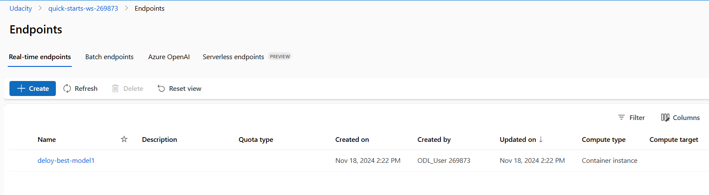

Screenshot showing model endpoint with deployment status as Completed, operation status as Healthy, and REST endpoint URI:
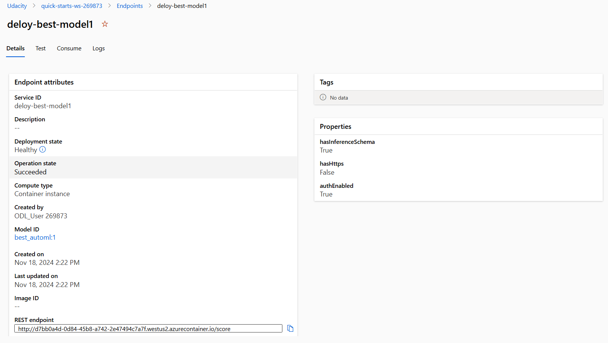


To interact with the deployed model, retrieve the scoring URI and API key. Include the key in the header for authorization and send a request to the URI.
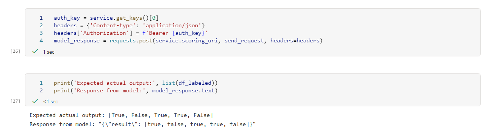
Example input data to get prediction from the endpoint:

```json
{
  "data": [
{"id": 7247, "limitBal": 230000, "sex": 1, "education": 1, "married": 1, "age": 32, "pay_0": 1, "pay_2": -2, "pay_3": -2, "pay_4": -2, "pay_5": -2, "pay_6": -1, "billAmt_1": 0, "billAmt_2": 0, "billAmt_3": 0, "billAmt_4": 0, "billAmt_5": 0, "billAmt_6": 150, "payAmt_1": 0, "payAmt_2": 0, "payAmt_3": 0, "payAmt_4": 0, "payAmt_5": 150, "payAmt_6": 990}
{"id": 8115, "limitBal": 90000, "sex": 0, "education": 2, "married": 2, "age": 28, "pay_0": 2, "pay_2": 0, "pay_3": 0, "pay_4": 0, "pay_5": 2, "pay_6": 0, "billAmt_1": 48177, "billAmt_2": 49563, "billAmt_3": 47750, "billAmt_4": 47169, "billAmt_5": 46284, "billAmt_6": 47519, "payAmt_1": 2500, "payAmt_2": 2500, "payAmt_3": 3700, "payAmt_4": 0, "payAmt_5": 2200, "payAmt_6": 1800}
{"id": 5309, "limitBal": 80000, "sex": 1, "education": 1, "married": 2, "age": 35, "pay_0": 0, "pay_2": 0, "pay_3": 0, "pay_4": 0, "pay_5": 0, "pay_6": 0, "billAmt_1": 52065, "billAmt_2": 55205, "billAmt_3": 55900, "billAmt_4": 55622, "billAmt_5": 56295, "billAmt_6": 61598, "payAmt_1": 5000, "payAmt_2": 2606, "payAmt_3": 2200, "payAmt_4": 2100, "payAmt_5": 6679, "payAmt_6": 1700}
{"id": 10268, "limitBal": 80000, "sex": 1, "education": 3, "married": 1, "age": 45, "pay_0": 0, "pay_2": 0, "pay_3": 2, "pay_4": 0, "pay_5": 0, "pay_6": 0, "billAmt_1": 8133, "billAmt_2": 10978, "billAmt_3": 10511, "billAmt_4": 11529, "billAmt_5": 12332, "billAmt_6": 13128, "payAmt_1": 3000, "payAmt_2": 0, "payAmt_3": 1200, "payAmt_4": 1000, "payAmt_5": 1000, "payAmt_6": 1000}
{"id": 5322, "limitBal": 60000, "sex": 0, "education": 1, "married": 2, "age": 26, "pay_0": -1, "pay_2": -1, "pay_3": 2, "pay_4": -1, "pay_5": 0, "pay_6": -1, "billAmt_1": 3437, "billAmt_2": 16932, "billAmt_3": 2301, "billAmt_4": 6220, "billAmt_5": 2227, "billAmt_6": 10416, "payAmt_1": 16960, "payAmt_2": 0, "payAmt_3": 6227, "payAmt_4": 0, "payAmt_5": 10416, "payAmt_6": 0}
  ]
}

```
For this example, the expected model response should be:
```text
Expected output: [1, 1, 0, 1, 0]
Model response: "{\"result\": [1, 1, 0, 1, 0]}"
```
**Get service log** \
Get all the service log

**Delete service** \
Delete the service after it all done
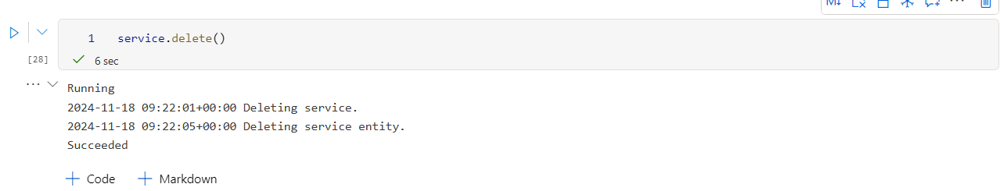

## Suggestions for Future Improvements
- Since this dataset is somewhat unbalanced, a different primary metric, like AUC-weighted, might yield better insights.
- The AutoML configuration works well as is, but hyperparameter tuning could be improved by:
  - Expanding the parameter range and including additional parameters.
  - Trying alternative base models for tuning.
  - Implementing a custom scoring function for metrics such as AUC-weighted.

## Screen Recording
[Youtube Screencast](https://youtu.be/GmuLMDjg9_I)
